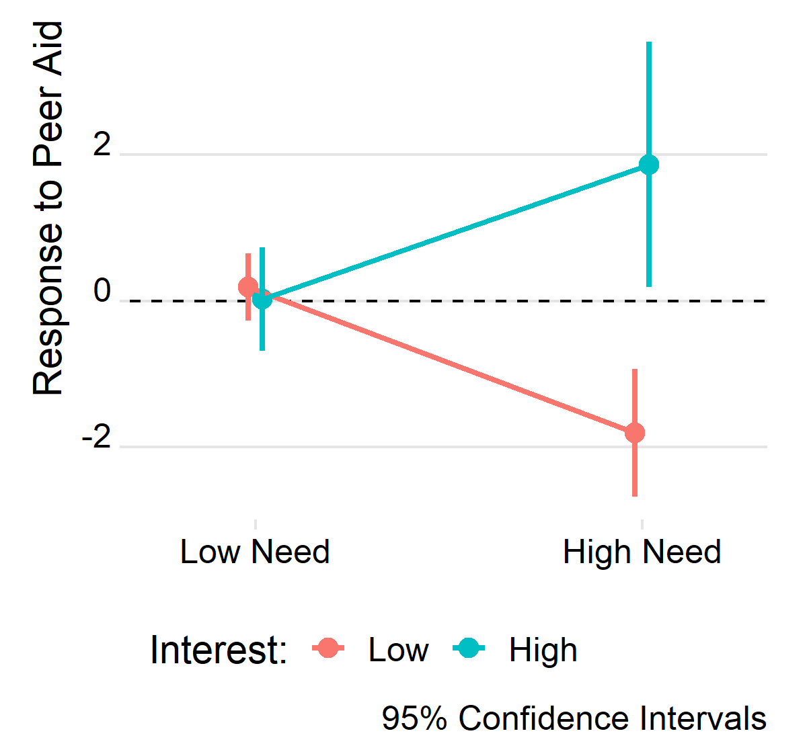

    <a class="active" href="https://milesdwilliams15.github.io/"><strong>Home</strong></a>
    <a href="https://github.com/milesdwilliams15/job-market-materials/raw/main/cv.pdf"><strong>My CV</strong></a>
    <!-- <a href="{{ site.github.owner_url }}"><strong>My GitHub</strong></a> -->
    <a href = "{{ site.data.social-media.email.href }}{{ site.data.social-media.email.id }}" title="Email me"><strong>Contact</strong></a>
    

        <button class="dropbtn"><strong>About</strong>
            <i class="fa fa-caret-down"></i></button>
        

            <a href = "https://milesdwilliams15.github.io/research/"><strong>Research</strong></a>
            <a href = "https://milesdwilliams15.github.io/software/"><strong>Software</strong></a>
            <a href = "https://milesdwilliams15.github.io/teaching/"><strong>Teaching</strong></a>
        

    

  
 

## Welcome! 
Welcome to my academic website. I am a Ph.D. candidate studying International Relations in the Department of Political Science at the [University of Illinois at Urbana-Champaign](https://pol.illinois.edu/). I also serve as a methods specialist for the [U.S. Office of Evaluation Sciences](https://oes.gsa.gov/team/miles-williams/). My primary research agenda centers on the political economy of foreign aid. In my dissertation, I study how the foreign policy interests industrialized countries promote through their foreign aid allocations explain their strategic responses to each other as they target economic assistance to developing countries. To address this issue, I rely on various tools, from formal theory, to machine learning as well as classical econometric techniques. You can click on the links above learn about my broader research agendas, software, and teaching.

---

<small>Hosted on GitHub Pages &mdash; Theme by <a href="https://github.com/orderedlist">orderedlist</a></small>

