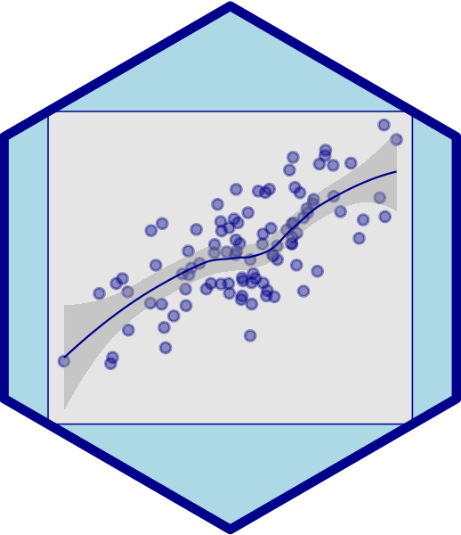

<!-- Load an icon library -->
<link rel="stylesheet" href="https://cdnjs.cloudflare.com/ajax/libs/font-awesome/4.7.0/css/font-awesome.min.css">

  

        <button class="dropbtn">
        <i class="fa fa-navicon"></i> Menu</button>
        

            <a href="https://milesdwilliams15.github.io/"><i class="fa fa-fw fa-home"></i> Home</a>
            <a href="https://milesdwilliams15.github.io/research/"><i class="fa fa-fw fa-area-chart"></i> Research</a>
            <a href="https://milesdwilliams15.github.io/teaching/"><i class="fa fa-fw fa-mortar-board"></i> Teaching</a>
            <a href="https://github.com/milesdwilliams15/job-market-materials/raw/main/cv.pdf"><i class="fa fa-fw fa-file"></i> My CV</a>
            <a href="{{ site.data.social-media.email.href }}{{ site.data.social-media.email.id }}"><i class="fa fa-fw fa-envelope"></i> Email Me</a>
            <a href="{{ site.github.owner_url }}"><i class="fa fa-fw fa-code-fork"></i> My GitHub</a>
            <a href = "https://milesdwilliams15.github.io/software/"><i class="fa fa-fw fa-gears"></i>My Software</a>
            <a href="https://milesdwilliams15.github.io/blog/"><i class="fa fa-fw fa-pencil"></i> My Blog</a>
        

    

  <a href="https://milesdwilliams15.github.io/"><i class="fa fa-fw fa-home"></i> Home</a>
  <a href="https://milesdwilliams15.github.io/research/"><i class="fa fa-fw fa-area-chart"></i> Research</a>
  <a href="https://milesdwilliams15.github.io/teaching/"><i class="fa fa-fw fa-mortar-board"></i> Teaching</a>

 

## About Me 
My name is Miles Williams and I am a Ph.D. candidate in the Department of Political Science at the [University of Illinois at Urbana-Champaign](https://pol.illinois.edu/). I also serve as an Associate Fellow specializing in methods with the federal [Office of Evaluation Sciences](https://oes.gsa.gov/). My research has appeared in a range of outlets, including peer-reviewed journals, book chapters, and online articles. 

My primary research agenda centers on identifying the foreign policy goals that motivate countries to give foreign aid. In my dissertation, I use game theory, classic econometrics, and machine learning to shed light on how foreign aid allocation serves as an arena of both strategic competition and buck-passing among donor governments.

In addition to studying foreign aid, I have supported numerous experimental, quasi-experimental, and descriptive evaluations for the federal government; collaborated on projects that apply text-as-data methods to religious political communication; and actively maintain projects centered on innovative applications of machine learning for causal inference and statistical approaches for testing theoretical models.

  <h3>Interests</h3>
    <ul class="ul-interests">
      <li>International Relations</li>
      <li>Political Economy</li>
      <li>Game Theory</li>
      <li>Statistical Methods</li>
      <li>Machine Learning</li>
      <li>Causal Inference</li>
    </ul>
  

  

  <h3>Education</h3>
    <ul class="ul-edu fa-ul">
      <li><i class="fa fa-fw fa-graduation-cap"></i><strong>PhD in Political Science, 2022 (expected)</strong>
        

          
University of Illinois at Urbana-Champaign

        

      </li>
      <li><i class="fa fa-fw fa-graduation-cap"></i><strong>MA in Political Science, 2016</strong>
        

          
Eastern Illinois University

        

      </li>
      <li><i class="fa fa-fw fa-graduation-cap"></i><strong>BA in History and Political Science; Philosophy, 2015</strong>
        

          
Greenville University

        

      </li>
    </ul>
  

---

<small>Hosted on GitHub Pages &mdash; Theme modified from <a href="https://github.com/orderedlist">orderedlist</a></small>

