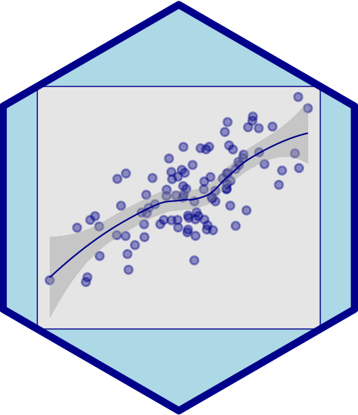

<!-- Load an icon library -->
<link rel="stylesheet" href="https://cdnjs.cloudflare.com/ajax/libs/font-awesome/4.7.0/css/font-awesome.min.css">

  

        <button class="dropbtn">
        <i class="fa fa-navicon"></i> More</button>
        

            <a href="https://milesdwilliams15.github.io/"><i class="fa fa-fw fa-home"></i> Home</a>
            <a href="https://milesdwilliams15.github.io/research/"><i class="fa fa-fw fa-area-chart"></i> Research</a>
            <a href="https://milesdwilliams15.github.io/teaching/"><i class="fa fa-fw fa-mortar-board"></i> Teaching</a>
            <a href="/assets/files/cv.pdf" target="_blank"><i class="fa fa-fw fa-file"></i> My CV</a>
            <a href="{{ site.data.social-media.email.href }}{{ site.data.social-media.email.id }}"><i class="fa fa-fw fa-envelope"></i> Email Me</a>
            <a href="{{ site.github.owner_url }}"><i class="fa fa-fw fa-code-fork"></i> My GitHub</a>
            <a href = "https://milesdwilliams15.github.io/software/"><i class="fa fa-fw fa-gears"></i>My Software</a>
            <a href="https://milesdwilliams15.github.io/blog/"><i class="fa fa-fw fa-pencil"></i> My Blog</a>
        

    

  <a href="https://milesdwilliams15.github.io/"><i class="fa fa-fw fa-home"></i> Home</a>
  <a href="https://milesdwilliams15.github.io/research/"><i class="fa fa-fw fa-area-chart"></i> Research</a>
  <a href="https://milesdwilliams15.github.io/teaching/"><i class="fa fa-fw fa-mortar-board"></i> Teaching</a>

 

## Welcome! 
I am a Visiting Assistant Professor of [Data for Political Research](https://denison.edu/academics/data-for-political-research) at Denison University. My research covers issues in international cooperation, conflict, political economy, and research methods. My teaching includes topics like data visualization, data modeling and research design, and international relations. I write a weekly newsletter, [*Foreign Figures*](https://mileswilliams.substack.com/), where I offer data-driven takes on international relations, thoughts on AI in research and the classroom, and updates on my research.

I earned my PhD from the [Department of Political Science](https://pol.illinois.edu/) at the University of Illinois at Urbana-Champaign and am an alum Associate Fellow in statistical methods at the [U.S. Office of Evaluation Sciences](https://oes.gsa.gov/).

  <h3>Interests</h3>
    <ul class="ul-interests">
      <li>International Cooperation</li>
      <li>International Conflict</li>
      <li>International Political Economy</li>
      <li>Statistical Methods</li>
      <li>Research Design</li>
    </ul>
  

  

  <h3>Education</h3>
    <ul class="ul-edu fa-ul">
      <li><i class="fa fa-fw fa-graduation-cap"></i><strong> PhD in Political Science, 2022</strong>
        

          
University of Illinois at Urbana-Champaign

        

      </li>
      <li><i class="fa fa-fw fa-graduation-cap"></i><strong> MA in Political Science, 2016</strong>
        

          
Eastern Illinois University

        

      </li>
      <li><i class="fa fa-fw fa-graduation-cap"></i><strong> BA in History and Political Science; Philosophy, 2015</strong>
        

          
Greenville University

        

      </li>
    </ul>
  

---

<small>Hosted on GitHub Pages &mdash; Theme modified from <a href="https://github.com/orderedlist">orderedlist</a></small>

